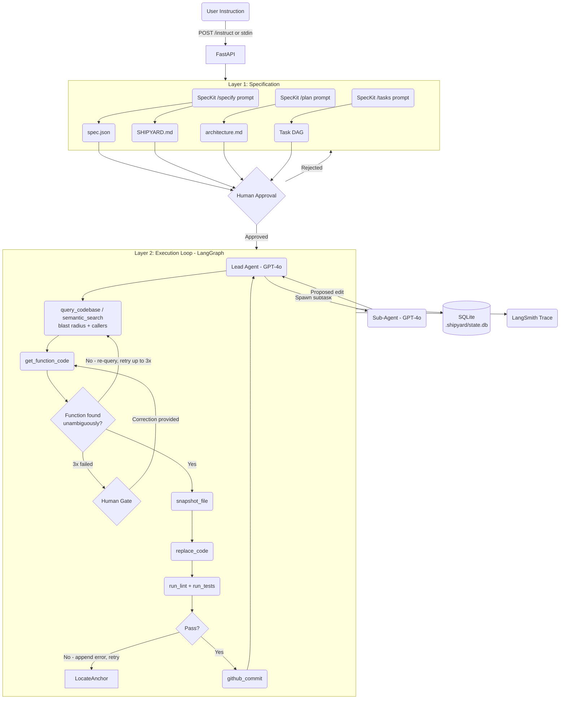

# PRESEARCH.md — Project Shipyard

> **Note on sources:** Agent research below is based on official documentation and
> AI-assisted synthesis. Items marked `TODO: READ SOURCE` require direct source-code
> review before final submission.

---

## Phase 1: Open Source Research

### Agent 1: Claude Code

**Source:** docs.anthropic.com/claude-code
`TODO: READ SOURCE — supplement with specific file references from anthropic-sdk repo`

**File editing:** Snapshot-based. Saves file state before every change, making all edits
reversible. Precision is model-dependent, not architecturally enforced. The
folder-permission model scopes the agent to one directory — it cannot read or write
outside it.

**Context across turns:** CLAUDE.md files — markdown committed to the repo, injected
automatically every session. If the session restarts, the agent re-reads CLAUDE.md and
recovers project conventions without re-prompting.

**Failed tool calls:** Failures are contained inside a VM. Build failures surface through
a lint-fix loop that appends error context to the next prompt.
`TODO: READ SOURCE — find tool retry logic and escalation path`

**What I'd take:** The repo-committed context file pattern (CLAUDE.md) and
snapshot-before-edit as a non-negotiable safety step.

**What I'd do differently:** Snapshots are reactive — they allow rollback after a bad
edit but don't prevent it. I want pre-write validation that blocks the write entirely if
the target can't be located unambiguously.

---

### Agent 2: OpenCode

**Source:** github.com/opencode-ai/opencode
`TODO: READ SOURCE — read packages/server/ for tool execution contract and the file
editing implementation`

**File editing:** Unified diff (git-style patches) as the primary strategy. Auditable
and precise, but requires the LLM to produce well-formed diffs consistently. The main
failure mode is line number drift — prior edits in the same session shift line numbers
and the patch lands in the wrong place.

**Context across turns:** LSP integration pipes live diagnostics directly into agent
context. Auto-Compact triggers summarization at 95% context usage and starts a fresh
session with the summary, preventing out-of-context failures silently.

**Failed tool calls:** A bad edit surfaces immediately as a build error through LSP,
piped back into context. The client-server architecture means the server keeps running
even if the client crashes.
`TODO: READ SOURCE — find retry count and escalation logic`

**What I'd take:** Feeding verification output (lint, errors) back into context as the
retry signal — simple and effective. Also the client-server separation so the agent
process survives UI crashes.

**What I'd do differently:** Unified diff is fragile on line drift. Anchor-based
replacement is more robust. LSP is genuinely powerful but non-trivial to wire — for MVP
I'll use `ruff`/`pytest` subprocess calls instead and treat LSP as a stretch goal.

---

### Agent 3: LangChain Open Engineer

**Source:** github.com/langchain-ai/open-engineer
`TODO: READ SOURCE — review Supervisor node implementation and LangGraph state schema`

**File editing:** Multi-tool middleware routes edits to domain-specialized sub-agents.
Flexible but adds coordination overhead and each sub-agent has narrower project context.

**Context across turns:** AGENTS.md for persistent project context. LangGraph durable
runtime provides checkpointing — the graph can pause, rewind, and resume from any prior
state.

**Failed tool calls:** LangGraph rewind is the recovery path — if a branch fails, the
supervisor reverts to a prior checkpoint and re-assigns rather than propagating bad
output forward.

**What I'd take:** LangGraph as the agent loop framework — checkpointing, state
persistence, and human-in-the-loop support are all built in. The Supervisor/Lead Agent
pattern for multi-agent coordination.

**What I'd do differently:** Keep multi-agent simple for MVP — one lead agent, one
sub-agent, sequential. Parallelism adds merge complexity that isn't worth it until the
core loop is solid.

---

### File Editing Strategy Decision

**Chosen: Code-Graph-RAG AST-targeted function replacement**

After reviewing the official site and installed package surface, Code-Graph-RAG is a
better fit for named-function edits than string anchors. Its documented workflow is to
query the code graph for callers and dependencies, retrieve the current function
implementation, and replace only the targeted function body. This reduces line-drift
and anchor-selection fragility while preserving surgical scope. Anchor replacement is
now reserved only for non-function targets where no named function wrapper exists.

**Failure mode:** Target function is not found, is ambiguous, or verification fails
after replacement.

**Handling:** Write is blocked until the agent re-queries blast radius, re-reads the
function via `get_function_code`, and proposes a corrected replacement. On repeated
failure, the loop pauses and surfaces the function name, file path, and verification
errors to the human before continuing.

**Operational note:** Code-Graph-RAG is not just an edit helper. The installed package
surface and official docs indicate a graph-backed system with Memgraph, indexing, MCP
tools, and repository update workflows. This means the MVP roadmap must treat graph
availability, indexing, and refresh behavior as first-class operational requirements.

---

## Phase 2: Architecture Design

### System Diagram



---

### File Editing Strategy — Step by Step

1. Agent calls `query_codebase()` or `semantic_search()` to understand which files are
   affected and what calls the target function before touching code
2. Agent retrieves the current implementation with `get_function_code(file, function)`
3. Agent proposes a full replacement for that named function
4. `snapshot_file` saves current content to `.shipyard/snapshots/<timestamp>-<filename>`
5. `replace_code(file, function, new_code)` performs the surgical function replacement
6. `run_lint` and `run_tests` run as subprocesses, stdout/stderr returned to agent as context
7. On failure: error appended to context, function re-read, retry counter increments
8. On pass: `github_commit` via GitHub REST API. Snapshot retained as rollback point
9. If the target is not a named function, use the fallback non-function edit path

---

### Supporting Infrastructure

**Code-Graph-RAG (code-graph-rag.com)**
Official docs and package inspection show a Memgraph-backed code graph system with MCP
tools for querying code relationships, retrieving function code, semantic search, and
surgical editing. The package installs as `code-graph-rag` but exposes most runtime
modules under `codebase_rag` plus the `cgr` CLI. The preferred edit path is:
`query_codebase()`/`semantic_search()` → `get_function_code()` → `replace_code()`.
This context is injected before the agent proposes the replacement so it understands
blast radius across the codebase, not just the local function body.

**Integration implication:** leaning on Code-Graph-RAG means the roadmap must include:
- how the repo is indexed before edits
- how Memgraph is started and verified
- how graph freshness is maintained after writes
- how the agent behaves when the graph is unavailable
- which integration boundary is authoritative: for this repo, that boundary is the
  `cgr` CLI rather than direct imports into internal package modules

**SpecKit (as structured prompt conventions)**
SpecKit is not installed as a dependency — it's implemented as a set of structured
prompt templates that enforce a specific workflow sequence before any code is written:
- `/specify` — captures the "what and why" of a feature into `spec.json`
- `/plan` — defines architecture choices and produces `architecture.md`
- `/tasks` — decomposes the plan into a dependency-ordered task DAG

This ensures no implementation task begins before its dependencies are resolved, and
the agent always has a written spec to work against rather than inferring intent from
a vague instruction.

---

### Multi-Agent Design

**Model:** Lead Agent + one Sub-Agent, sequential. One lead agent owns the full loop.
Sub-agent is spawned for isolated subtasks — e.g., generating tests while the lead agent
works on the implementation.

**Communication:** Lead Agent passes a scoped task + relevant file context to the
Sub-Agent as a structured prompt. Sub-Agent returns a proposed replacement function body
plus blast-radius notes. Lead Agent validates and applies it through the same
Code-Graph-RAG edit pipeline.

**Merge:** Lead Agent applies sub-agent edits sequentially after its own edits for the
current task — no simultaneous writes to the same file.

**Conflict resolution:** If a sub-agent targets a block the Lead Agent already modified,
the Lead Agent re-reads the updated file and passes it to the sub-agent for a revised
proposal.

---

### Context Injection

All external context is passed through the LangGraph state object — not appended to
chat history. Typed, inspectable, doesn't pollute the conversation.

| Context Type | Format | When Injected |
|---|---|---|
| Feature instruction | Plain text or markdown | Entry — POST /instruct or stdin |
| SHIPYARD.md | Markdown | Session start, every session |
| spec.json | JSON | Start of execution, from SpecKit /specify |
| architecture.md | Markdown | Start of each task, from SpecKit /plan |
| Task DAG | JSON | Before execution begins, from SpecKit /tasks |
| Code-Graph-RAG query result | JSON — callers, imports, blast radius | Before function replacement |
| Lint / test failure | Plain text stderr/stdout | Appended on verify failure, before retry |
| Sub-agent output | Structured text | Passed to Lead Agent at merge step |
| Human correction | Free text | At Human Gate, replaces current task instruction |

---

### Additional Tools Needed

| Tool | Implementation |
|---|---|
| `read_file(path)` | Plain Python `open()` |
| `replace_code(file, function, new_code)` | Code-Graph-RAG AST-targeted function replacement |
| `snapshot_file(path)` | Copy to `.shipyard/snapshots/<timestamp>-<filename>` |
| `revert_file(path, snapshot)` | Copy snapshot back to original path |
| `run_lint(path)` | Subprocess — `ruff` or `eslint`, capture stdout/stderr |
| `run_tests(scope)` | Subprocess — `pytest` or `jest`, capture result |
| `query_codebase(query)` | Code-Graph-RAG natural-language graph query for callers and dependencies |
| `semantic_search(query)` | Code-Graph-RAG embedding search for intent-based lookup |
| `get_function_code(file, function)` | Code-Graph-RAG function retrieval by name |
| `github_commit(message, files)` | GitHub REST API `PUT /repos/.../contents/...` |
| `github_create_branch(name)` | GitHub REST API `POST /repos/.../git/refs` |
| `spawn_sub_agent(task, context)` | GPT-4o call with scoped prompt, returns proposed edit |
| `human_gate(message)` | Block loop, print to stdout, wait for stdin |

---

## Phase 3: Stack and Operations

### Q9 — Framework

**LangGraph + GPT-4o.** LangGraph provides durable state, checkpointing, and
human-in-the-loop support out of the box. GPT-4o is the LLM — strong code reasoning,
well-documented, straightforward via the OpenAI SDK. LangSmith tracing is automatic
once `LANGCHAIN_API_KEY` is set.

---

### Q10 — Persistent Loop

Runs as a local Python process. State checkpointed to SQLite via `AsyncSqliteSaver`
after every node transition. The process can be stopped and restarted — it resumes from
the last checkpoint using the session `thread_id`.

Instructions accepted two ways:
- **stdin** — interactive, type directly into the running process
- **FastAPI endpoint** — `POST /instruct` with a JSON body, for scripting or piping
  in context programmatically

In addition to the loop itself, the graph-backed edit path requires a graph service to
be available before named-function edits are allowed. The loop should be able to report
three states clearly:
- graph ready
- graph missing
- graph stale and needs refresh

Chosen operating mode: `cgr` CLI orchestration. This keeps the integration aligned with
the package's primary interface instead of coupling the agent to internal Python
modules under `codebase_rag`.

```bash
# Start new session
python shipyard.py --new

# Resume existing session
python shipyard.py --resume <thread_id>
```

---

### Q11 — Token Budget and Cost Cliffs

`TODO: Replace with actuals after first development runs`

Estimates using GPT-4o (~$2.50/1M input, ~$10/1M output):

| Operation | Input tokens (est.) | Output tokens (est.) | Est. cost |
|---|---|---|---|
| SpecKit specify/plan/tasks | ~4,000 | ~2,000 | ~$0.030 |
| Code-Graph-RAG query + result | ~2,000 | — | ~$0.005 |
| Single edit cycle | ~5,000 | ~1,000 | ~$0.023 |
| Lint-fix retry | +~1,500 | ~1,000 | +~$0.014 |
| Sub-agent task | ~3,000 | ~1,000 | ~$0.018 |

**Cost cliffs:**
- Large files — reading a 1,000-line file costs ~2,500 tokens. Use Code-Graph-RAG to
  scope which function actually needs reading before proposing a replacement
- Retry accumulation — each retry appends error context; cap at 3 retries per edit
- Code-Graph-RAG queries are cheap individually but add up on large codebases — query by
  specific function, not whole repo

---

### Q12 — Bad Edit Detection and Recovery

**Detection, in order:**

1. **Function resolution (pre-write):** if `get_function_code()` cannot resolve the
   target function unambiguously, the write is blocked. Nothing touched.
2. **Lint subprocess (post-write):** `ruff`/`eslint` runs immediately after every write.
   Errors returned as text to agent context.
3. **Test subprocess (post-write):** `pytest`/`jest` runs after lint passes.

**Recovery:**

- Error appended to context → retry from function retrieval, counter increments
- After 3 failed attempts: `human_gate()` blocks the loop, shows file + function name +
  failure details, waits for human input
- Human can provide a corrected function target, approve a revert, or skip the task
- `revert_file()` restores from snapshot — every edit has a restore point

---

### Q13 — Logging and Run Trace

**Tracing:** LangSmith — automatic via LangGraph once `LANGCHAIN_API_KEY` is set.

Every node logs: node name, tool called, file path, function name, edit applied (y/n),
lint result, test result, retry count, token usage, timestamp.

**Happy path trace:**
```
query_codebase   → "get_user" — 3 callers, 2 import deps
get_function_code → src/api/routes.py:get_user — found ✓
snapshot_file    → .shipyard/snapshots/20260323-091406-routes.py
replace_code     → success
run_lint         → PASS
run_tests        → 14/14 PASS
github_commit    → "feat: add rate limiting to get_user" — sha: a3f9c2
```

**Error branch (function miss → lint fail → pass):**
``` 
get_function_code → "get_user" — not found ✗  [attempt 1]
query_codebase   → refined caller lookup
get_function_code → "UserService.get_user" — found ✓
snapshot_file    → .shipyard/snapshots/20260323-092208-routes.py
replace_code     → success
run_lint         → FAIL: undefined name 'rate_limit'  [attempt 2]
get_function_code → re-read with error context
replace_code     → success
run_lint         → PASS
run_tests        → PASS
github_commit    → done  [attempt 2 total]
```

---

## Architecture Decision Summary

| Decision | Choice | Why |
|---|---|---|
| Editing strategy | Code-Graph-RAG AST function replacement | Better function targeting, caller awareness, and blast-radius context |
| Multi-agent model | Lead Agent + one Sub-Agent, sequential | Debuggable, mergeable, right-sized for a week |
| Framework | LangGraph | Persistence, checkpointing, HITL all built-in |
| LLM | GPT-4o (OpenAI) | Strong code reasoning, required by project |
| Context engine | Code-Graph-RAG | Graph-based blast radius analysis plus function retrieval before any edit |
| Spec workflow | SpecKit prompt conventions | Enforces specify → plan → tasks order without extra deps |
| Persistent context | SHIPYARD.md committed to repo | Survives restarts, no re-prompting |
| Loop persistence | AsyncSqliteSaver (SQLite) | Local, zero infrastructure, resumes from checkpoint |
| Instruction intake | FastAPI `POST /instruct` + stdin | Scriptable and interactive |
| Version control | GitHub REST API | Programmatic commits and branching |
| Verification | `ruff`/`pytest` subprocesses | Simple, reliable, output piped to agent |
| Failure recovery | Snapshot + revert + human gate | Every edit reversible, human stays in control |
| Tracing | LangSmith | Automatic with LangGraph, zero extra code |

## Roadmap Correction

To use Code-Graph-RAG seriously, the next implementation roadmap needs to prioritize:

1. Graph runtime bootstrap
   Memgraph availability, `cgr doctor`, repository indexing, and health checks.
2. Function-edit integration
   `cgr`-backed query and retrieval flow for function edits.
3. Graph freshness workflow
   Re-indexing or graph update behavior after writes.
4. Fallback boundaries
   Anchor/string replacement only for non-function targets.
5. Observability
   Traces should capture whether the graph-backed or fallback path was used and why.

---

*PRESEARCH.md — Project Shipyard | 2026-03-23*
*TODOs must be resolved before Final Submission*
